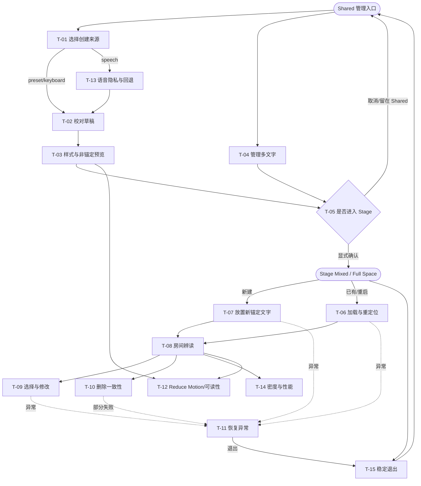

# 交互 / 空间设计规格 · 悬浮文字疗愈空间

> Role: `task_decision_designer` / `interaction_xr_designer` | Active source revision: 7 | Current workflow coverage: Stages 5–6 and 9–11 + bounded DS-02/DS-04 reconciliation + provenance-only DS-04R correction
>
> Provenance: rev 5 integrated Stage 11 facts generated from this document’s rev 4. CR-DS-01-04 produced rev 6 against UXR rev 3 (provenance-only), Spatial Composition rev 2, Spatial Design System rev 2 and Visual System rev 4. CR-DS-04R now points the active §14/§15 composition authority to Spatial Composition rev 3 against Critique rev 5; no H-A, task, container, state, value or layout fact changed.

## 0. 推理边界

- 任务先于界面；每个任务描述用户要做的决定，而非页面名称。
- Shared Space Volumetric 只承担管理、样式和非真实锚定预览；所有真正 Anchor 的 load/view/place/update/delete/restart relocation 都在用户显式进入的 Stage Mixed。
- Stage→Shared handoff/visibility 是 UXR P-02A 的低置信 evidence gap，不能作为当前任务成功路径。
- Stage 5 不选择概念、容器尺寸、附件、布局或组件；只建立任务、决定、依赖、失败后果和返回路径。

## 1. 直接产出

本修订交付完整的任务/决定图、任务依赖、异常/返回边界、竞品功能覆盖对账，以及多文字、语音回退、Reduce Motion、删除一致性和性能任务。

## 2. 设计原则

| # | Assertion-style principle | Scope | Derivation basis | Downstream checkpoint | Conflict precedence |
|---|---|---|---|---|---|
| P1 | 任何 world-locked 状态必须由 Stage Mixed 中当前成功定位的 Anchor 证明；Shared 不得显示或暗示真实房间锚定内容。 | spatial / data trust | PM R-ANCHOR-SPACE、R-ANCHOR-TRUTH；UXR P-02/P-02A；Stage 4 EV-01 closure | §4–§7、§10 状态、Anchor/Room 状态标签、真机测试 | 最高；高于“随时抬眼可见”、低摩擦和视觉连续性 |
| P2 | 仅当方向、距离、深度或真实位置改变任务结果时才进入 Stage；内容、样式、列表、输入和非锚定预览留在默认 Shared Volumetric。 | product / spatial | Spatial Value Engine；UXR F-01/F-02；T-01–T-15 | §4 逐任务 2D 反事实、§7 容器职责 | 低于 P1，高于沉浸感或新奇性 |
| P3 | 每次 Stage 进入必须显式说明空间模式切换，每个正常/异常路径都能回到 Shared 稳定管理态。 | interaction / safety | PM O-05/R-ANCHOR-SPACE；T-05/T-11/T-15；UXR S-01 | §7 入口/退出、§10–§11 返回路径 | 与任务效率冲突时，稳定退出优先 |
| P4 | 多文字同时存在时恰有一个主焦点；性能降级先减弱非选中 glow、mesh 细节和动画，不降低文字正确性、锚点真值或错误可见性。 | interaction / performance / data trust | PM O-08/FR-17/28/30；T-04/T-08/T-14 | §10 selected 状态、§12 输入、性能验收 | 正确性/状态真值高于帧率装饰；安全帧率高于装饰保真 |
| P5 | 语音永远是一次性可选输入；拒权、无服务、无网、超时或语言不支持均在一步内保留草稿转键盘，且不保存音频。 | interaction / privacy / accessibility | UXR P-07/F-04/C-04；PM R-PRIVACY；T-01/T-13 | §10 input states、§12 fallback、语音异常矩阵 | 隐私与任务可达性高于语音速度 |
| P6 | 动效不得承载唯一状态语义；Reduce Motion/静止分支保留焦点、选择、错误和保存反馈，默认 5cm/8s、6s、80% 仅是低置信待测目标。 | motion / accessibility / safety | UXR S-02；PM A-11/O-07；T-12/T-14 | §12–§13、亮暗房设备观察 | 舒适与可读性高于品牌动效 |
| P7 | 删除是 Room 与 Anchor 的一致性事务：先明确确认，再记录双存储进度；部分失败显示 pending repair，绝不虚报完成。 | data trust / safety | PM R-DELETE/O-10；T-10/T-11 | §10 删除状态、repository contract、强制故障测试 | 数据一致性高于快速退出和视觉简洁 |

- **原则冲突仲裁**：依次遵循 P1 数据/空间真值 → P3/P6 安全、舒适与稳定退出 → P7 数据一致性 → P5 隐私与可达性 → P4 语义与性能 → P2 空间克制。若真实锚定价值与 Shared 共存冲突，必须进入 Stage 或诚实降级为非锚定预览，不允许视觉伪装。
- **Negative list**：禁止 WindowContainer 内调用/暗示 Anchor；禁止退出 Stage 后仍承诺真实锚定文字可见；禁止自动进入 Stage；禁止用 last-known transform 冒充 located；禁止用语音作为唯一入口或持续监听；禁止无确认删除、静默部分删除、相机运动、持续闪烁和以漂浮窗口制造伪空间感。
- **与选定概念一致性**：P1–P7 约束 §6 选中的 H-A“双域诚实接力”；其 Shared 根与 Stage 真锚定职责分离，不依赖 P-02A 跨空间假设。

## 3. Task / Decision Model

### 3.1 任务与决定表

| Task ID · Task | Actor | Scenario / Space state | Input information (evidence) | Decision output | Consequence of error | Frequency | Dependencies | Decision duration scale |
|---|---|---|---|---|---|---|---|---|
| T-01 选择创建来源 | 用户 | Shared Space 管理态，新建一句 | 用户目标；20 条本地预设；键盘可用；Speech support/permission；PM O-01/FR-04/05/19/26，UXR P-07 | `preset` / `keyboard` / `speech`；若 speech 不可用则选择 keyboard，不丢草稿 | 强制语音会阻断创建；错误来源会泄露隐私或丢失内容 | 偶发 | none | 预设可放置目标 ≤20s、键盘 ≤45s，均为 PM 目标非研究基线 |
| T-02 校对句子草稿 | 用户 | Shared Space，输入完成或语音 partial/final | draft text、识别置信/错误、字符与空值校验；UXR InputDraft/P-07 | 接受、继续编辑、清空或取消；只有用户确认的 final 文本可持久 | 错字未经确认进入空间会削弱信任；取消后仍保存是数据错误 | 每次创建/文本编辑 | T-01 | 未知，记录 P50/P90 |
| T-03 决定样式与非锚定预览 | 用户 | Shared Space Volumetric | 三类字体、五色 token、大小、80% 默认透明度、厚度目标、双面/Billboard preview；PM O-02/O-03/FR-06–16 | 保存样式草稿、恢复默认或取消；明确预览 `not_world_anchored` | 把预览误认为真实 anchor 会形成空间状态误导；可读性不足会看错句子 | 每次创建/可选编辑 | T-02 | 样式编辑目标 ≤30s（P75），待测 |
| T-04 管理多文字集合 | 用户 | Shared Space 管理态 | HealingText/Style/AnchorLink 摘要、located 状态、更新时间；PM FR-17/27，UXR entities | 新建、选择某段管理、排序/过滤、发起 Stage 查看或删除；决定同时目标数量 | 选错对象导致编辑/删除错误；用 last-known 冒充 located 破坏信任 | 高频短时 | T-02 或已有 Room 数据 | glance 时长未知；不得以列表代替 Stage 内空间辨读 |
| T-05 决定是否进入真实锚定模式 | 用户 | Shared Space → explicit Stage Mixed / Full Space | 当前任务是 view/place/update/delete/restart relocation；空间切换说明；未保存草稿；PM R-ANCHOR-SPACE，UXR P-01/P-02 | 明确 `enter_stage` 或 `stay_shared/cancel`；进入前保存 Shared 草稿并记录返回点 | 未确认切换违背稳定控制；把 Stage 当 Shared 会误导；取消丢草稿 | 每次真实 anchor 任务 | T-03/T-04 | 进入成本未知，单独测量 |
| T-06 加载与重定位已有锚点 | 用户 + 系统 | Stage Mixed，首次进入或重启后 | Anchor UUID、tracking/permission/space state、3m/5m 引导、Anchor events；UXR P-02–P-04/P-02A | `located`、`needs_observation`、`missing`、`permission_denied`、`retry`、`re_place` 或 `exit_stage` | 用 last-known 伪装 located 会把文字放错位置；无稳定退出会困住用户 | 每次 Stage 回访/重启 | T-05；已有 AnchorLink | 恢复时长无基线；PM E-05 只要求 Stage 内 5/5 成功或真实失败状态 |
| T-07 放置新锚定文字 | 用户 + 系统 | Stage Mixed，新建/重新放置 | 已确认文本/样式、候选 pose、距离/遮挡、mapping guidance、anchor save progress | 确认 pose 并创建/保存 UUID，或移动候选、取消并返回 Shared | 错位置、遮挡或保存失败会让重启恢复不可信；未保存却显示成功是 P0 | 每次新建/重放 | T-05；T-03；必要时 T-11 | 未知；记录完成/取消/失败时长 |
| T-08 在房间中辨读锚定文字 | 用户 | Stage Mixed，anchors located | world transforms、Billboard、样式、visibility、Reduce Motion、tracking；PM O-03/O-07/E-03 | 找到并读出目标句；决定继续观看、选择编辑或退出 | 多对象争夺中心、遮挡或错误朝向会延迟辨读/诱发不适 | 高频短扫视，但仅在 Stage 打开时 | T-06 或 T-07 | located 后目标 ≤2s（P75），进入/重定位另计 |
| T-09 选择并修改锚定对象 | 用户 | Stage Mixed，已有可见对象 | hit/collision、selected object ID、drag/scale/roll/style draft、Anchor update state；PM FR-20–23/25 | 选择、拖拽、双手缩放/旋转参考、样式调整；保存/取消；controller/inline fallback | 误选或更新半成会移动错误对象；Billboard 下旋转无可见反馈会困惑 | 偶发 | T-08；可转 T-11 | 保存目标 ≤30s（P75），待测 |
| T-10 删除文字与锚点 | 用户 + 系统 | Shared 发起意图；Stage Mixed 执行真实 anchor 删除 | localId/UUID、删除风险、Room 与 Anchor delete progress、部分失败状态；PM R-DELETE/O-10/FR-24/27/32 | 确认/取消；若确认，得到 `deleted_both`、`anchor_deleted_room_pending`、`room_deleted_anchor_pending`、`retry` | 静默部分删除产生 orphan；删错不可恢复；取消仍执行是严重错误 | 低频高风险 | T-04→T-05 或 T-08 | 无基线；确认不得被性能优化跳过 |
| T-11 恢复跟踪/权限/锚点异常 | 用户 + 系统 | Stage Mixed 异常态 | error source、anchor/tracking/permission、last successful step、草稿/transform snapshot；UXR risk model | 重试、靠近并环视、授权、重新放置、回滚或退出 Stage；不得假装成功 | 隐藏来源导致无效重试；无退出导致被困；错误回滚损坏数据 | 异常触发 | T-06/T-07/T-09/T-10 | 每条异常都须在 1 个明确决定内给下一步 |
| T-12 选择运动与可读性偏好 | 用户 | Shared 或 Stage 的可访问设置/快速入口 | Reduce Motion、text scaling、环境对比、5cm/8s/6s 仅低置信目标；PM A-11/R-SAFETY，UXR S-02 | 正常/Reduce Motion/静止；增大文字；降低光晕/运动；保留状态语义 | 无静止分支会造成不适；仅隐藏动画但丢失焦点反馈会破坏可用性 | 初次/按需 | 可随 T-03/T-08/T-09 进入 | 立即生效；10 分钟观察仅发现问题 |
| T-13 处理语音隐私与回退 | 用户 + 系统 | Shared 输入会话 | RECORD_AUDIO 状态、on-device support、network/language/timeout、partial draft；UXR P-07，PM E-07/R-PRIVACY | 允许一次识别、拒绝并转键盘、取消监听；离开即 destroy；不保存音频 | 连续监听/静默上传风险；拒权后死路；fallback 丢草稿 | 语音创建时 | T-01；回到 T-02/keyboard | 故障后 ≤1 步到键盘且草稿不丢 |
| T-14 控制多文字密度与性能 | 用户 + 系统 | Stage Mixed，5+ 文字；Shared preview 集合 | visible count、distance、LOD/cache state、frame timing、selected priority；PM O-08/FR-28/30 | 保持主焦点 1；缓存/LOD/降低非选中 glow/冻结增强动效；绝不降低文本正确性或删除状态 | 掉帧、热降频、错字纹理或隐藏关键异常破坏验收 | 持续系统决定 + 用户选择可见集合 | T-06/T-08 | 设备持续 60fps 目标；模拟器不可关闭该验收 |
| T-15 退出 Stage 并返回 Shared 管理态 | 用户 + 系统 | 任意 Stage 正常/异常/系统 back | dirty draft、in-flight anchor op、last stable Room state、return target；PM O-05/R-ANCHOR-SPACE | 保存/放弃/等待或取消 in-flight；关闭 Stage；回 Shared 管理/样式/非锚定预览，真实锚定实体不承诺可见 | 退出时半写入产生孤儿；返回 Shared 仍标 world-locked 造成证据误导 | 每次 Stage 会话 | T-05–T-14 任一 | 稳定退出优先于速度；不得阻塞 system back 无解释 |

### 3.2 Task dependency graph

### 3.3 Decision graph

| Decision ID | Trigger / evidence | Options | Output consumed by | Wrong-decision consequence |
|---|---|---|---|---|
| D-01 input route | preset/keyboard/speech support + privacy | preset / keyboard / one-shot speech / cancel | T-02/T-13 | creation blocked or privacy breached |
| D-02 draft validity | content/recognition result | accept / edit / cancel | T-03/Room draft | wrong message becomes spatial object |
| D-03 preview truth | space state + anchor state | show `non-anchored preview` / no preview | T-03/T-04 | Shared preview misrepresented as world-locked |
| D-04 Stage entry | task requires true anchor lifecycle | enter Stage / remain Shared / cancel | T-06–T-10 | illegal API assumption or unwanted Full Space switch |
| D-05 anchor recovery | load/tracking/permission result | observe/retry/authorize/re-place/exit | T-06/T-11 | wrong spatial location or dead end |
| D-06 manipulation commit | selected ID + dirty transform/style | save / cancel / retry | Anchor/Room consistency | update wrong object or partial commit |
| D-07 deletion consistency | user confirm + two-store state | cancel / delete / repair partial failure | T-10/T-11 | data loss or orphaned anchor/row |
| D-08 motion policy | user preference + performance | normal / reduce / static / performance fallback | T-08/T-12/T-14 | discomfort or loss of state feedback |
| D-09 Stage exit | dirty/in-flight state | save/wait/cancel op/discard/exit | T-15/Shared return | orphaned data or trapped user |

### 3.4 Exception, back, and stable-return contract at task level

| From task | Exception / back trigger | Required decision | Stable return | Preserved data |
|---|---|---|---|---|
| T-01/T-13 | mic denied, no recognizer, network/language/timeout | switch to keyboard or cancel | T-02 keyboard / Shared | existing partial draft when policy allows; no audio |
| T-02/T-03 | system back or cancel | discard only new draft vs keep saved version | Shared T-04 | last saved HealingText/Style |
| T-05 | user rejects Full Space switch | stay Shared | T-03/T-04 | all local drafts |
| T-06 | anchor unlocated/missing | observe, retry, re-place, exit | T-11 or T-15 | UUID/status; lastKnown not shown as located |
| T-07/T-09 | create/update fails | retry, rollback, cancel | prior stable Stage view or T-15 | previous committed Anchor/Room state |
| T-10 | one store deletes, the other fails | retry repair, mark pending, no false success | T-11, then Shared with explicit pending status | consistency journal / remaining identifier |
| T-12/T-14 | motion discomfort or frame pressure | reduce/static/performance fallback | same task and semantics | selected object, text correctness, error labels |
| any Stage task | system back / user exit | resolve dirty/in-flight operation; never silently commit | T-15 → Shared T-04 | last stable state + explicit pending/error |

### 3.5 Multi-text, performance, and accessibility design constraints derived from tasks

- Multiple texts are independent entities; selection must resolve exactly one primary focus before edit/delete.
- Five or more visible anchored texts are evaluated inside Stage Mixed. Shared may show multiple management records/non-anchored previews but never claim room transforms.
- Cache and LOD may reduce glow, mesh detail or non-selected animation, but may not change content, double-sided reading, anchor status, error source or deletion state.
- Reduce Motion switches float/hover amplification to static or opacity-only feedback while preserving focus/selected/error semantics.
- Controller and keyboard/inline controls are required fallbacks for two-hand, gaze and speech failures; exact UI attachment is deferred.

### 3.6 Competitive functional coverage check

| Benchmark requirement/opportunity | Task coverage | Deliberate omission / boundary |
|---|---|---|
| Preset content and personalization (C-02/C-03) | T-01–T-04 | reminders/notification schedule omitted: user asked spatial placement, not notification delivery |
| User voice participation (C-04) | T-01/T-02/T-13 | recording/playback and background music omitted; Speech-to-Text only, no stored audio |
| Persistent room placement/rearrange/remove (C-01) | T-05–T-11/T-15 | actual behavior limited to Stage Mixed; no Apple surface-widget structure copied |
| Distance-glanceable content (C-01) | T-08/T-12/T-14 | target remains evidence-tested in Stage; no Shared cross-space promise |
| Low-distraction continuing presence (market opportunity) | Shared T-04 management + Stage T-08 viewing | full “always there in Shared” deliberately not promised due P-02A |

### 3.7 Key decision list

1. Which sentence and input route should be used, and has the user confirmed the exact text?
2. Which style remains readable and calming at the intended Stage viewing distance?
3. Is the user willing to enter Full Space/Stage for any true anchored viewing or manipulation?
4. Which anchors are actually located, and which require observation, retry or re-placement?
5. Which one of multiple texts is the current primary focus?
6. Should a manipulation be saved, cancelled or rolled back?
7. Should deletion proceed, and how should partial Room/Anchor failure be reconciled?
8. Should motion be normal, reduced or static, and what performance fallback preserves semantics?
9. Can Stage exit safely now, or must an in-flight operation be resolved first?

## 4. Spatial Value Justification

> `High` 只授予真实方向/距离/深度/位置会改变任务正确性的 Stage 任务；`Low` 表示 2D/有边界 Volumetric 足够，使用 Stage 反而增加切换和舒适成本。所有 collaboration 目前均为单人本地，未发现多人协作价值。

| Task | Spatial value judgment (direction / distance / scale / depth / position / motion / body / collaboration / simulation / time) | Spatialization rationale | 2D counterfactual | Benchmark | Rating |
|---|---|---|---|---|---|
| T-01 选择创建来源 | direction/distance/depth/position/body/collaboration/simulation: none；scale/motion/time: low | 这是离散输入路线决定，空间方位不改变答案。 | Shared 内列表/按钮即可完成；禁止为输入打开 Stage。 | C-02/C-03 快速选择；C-04 语音参与 | Low |
| T-02 校对草稿 | scale: readable text；time: partial→final；其余 none | 准确校对依赖文本差异与时间状态，不依赖房间位置。 | 2D 编辑字段、final 确认与错误提示更高效。 | C-04 自定义内容；避免强制录音 | Low |
| T-03 样式与非锚定预览 | scale/depth/motion: medium；direction/distance/position/body: bounded preview only；collaboration/simulation: none；time: animation preview | 轻微厚度、双面、Billboard 和运动需要有限 3D 预览，但不需要真实房间坐标。 | 2D 字体/颜色/数值控制足以编辑；无 3D 时用正反面缩略图与动画开关。 | C-03 个性化；避免换肤冒充空间化 | Medium (Volumetric, no Stage) |
| T-04 管理多文字 | time: recency/status；scale: list density；其余 none | 排序、过滤、状态和对象选择是信息管理。 | 2D 列表/卡片最清楚；不得在 Stage 摆一圈菜单。 | C-02/C-03 内容管理 | Low |
| T-05 决定进入 Stage | position/time/body: medium because switch changes capability and context；其余 low | 空间价值在于告知“接下来将进入能合法处理真实锚点的空间状态”，而非制造沉浸。 | 2D 明示说明、确认和取消足够；确认后才切换。 | UXR P-02；C-01 的持久位置需求 | Medium |
| T-06 加载/重定位 | direction/distance/depth/position/body/time: high；scale/motion: medium；collaboration/simulation: none | 用户必须在真实房间靠近、环视并区分 located/missing；这些变量直接决定锚点是否恢复。 | 2D 可列 UUID/status/重试，但无法证明房间 pose；故真实任务必须 Stage。 | C-01 重入房间再现；UXR P-03/P-04 | High (Stage) |
| T-07 放置新文字 | direction/distance/scale/depth/position/body: high；motion/time: medium；collaboration/simulation: none | 候选 pose、遮挡、阅读距离与保存进度必须相对于用户和房间判断。 | 2D 可保存一个抽象位置或在 preview 中排版，但不能创建真实房间 Anchor。 | C-01 放置/移动；避免强制表面吸附 | High (Stage) |
| T-08 房间辨读 | direction/distance/scale/depth/position/body: high；motion/time: medium；collaboration/simulation: none | 核心价值是从真实方向与距离抬眼辨读；Billboard/双面需随观察位置更新。 | 2D 可显示句子，但退化为普通 quote app，不提供房间位置记忆线索。 | C-01 距离扫视；C-02/C-03 仅屏幕持续触达 | High (Stage) |
| T-09 选择/修改锚定对象 | direction/distance/scale/depth/position/body: high；motion/time: medium；collaboration/simulation: none | 命中、拖拽、缩放和参考角度改变真实 Anchor/实体关系，错误对象会被移动。 | 2D 表单能改样式/数值；但不能可靠验证实际 pose，故 pose 操作在 Stage，复杂文字编辑可回 Shared。 | C-01 重排；UXR P-05 | High for pose / Low for text fields |
| T-10 删除文字与锚点 | position/time: high for anchor identity/lifecycle；direction/distance/body: medium when selecting target；其余 low | 在 Stage 确认可见 anchor 身份，删除需协调 Anchor+Room；危险性来自数据一致性，不来自 3D。 | Shared 可发起某条记录的删除意图，但真实 Anchor delete 和最终成功判断必须 Stage；纯本地未锚定草稿可 2D 删除。 | C-01 删除闭环 | Medium–High (Stage for true anchor) |
| T-11 异常恢复 | direction/distance/position/body/time: high for tracking/relocation；scale/depth/motion: medium；collaboration/simulation: none | 靠近、环视、重放与回滚依赖环境和上次稳定状态；需要始终可退出。 | 2D 能解释错误、授权和记录日志，但不能完成重定位；若不继续则回 Shared pending 状态。 | C-01 暗环境/表面检测失败提示；UXR P-04 | High when recovery needs room observation |
| T-12 运动/可读性偏好 | scale/motion/time: medium；distance: medium for preview validation；其余 low | 用户需比较正常/Reduce/静止与可读性，但不需要真实 Anchor 才能做默认设置。 | Shared 2D controls + Volumetric nonanchored preview 足够；Stage 中只提供就地快捷切换。 | S-02 evidence gap；C-03 避免背景压过文字 | Medium (no Stage prerequisite) |
| T-13 语音隐私/回退 | time: session lifecycle；其余 none | 一次性监听、权限与草稿接力是流程问题。 | Shared 2D 权限说明、监听状态和键盘 fallback 最合适。 | C-04；UXR P-07 | Low |
| T-14 密度与性能 | scale/distance/depth/position/motion/time: high in actual room；direction/body: medium；collaboration/simulation: none | 5+ anchored texts 的遮挡、距离 LOD、主焦点与帧压只能在 Stage/真机真实观察。 | Shared 可用 2D 列表和 bounded previews 压测缓存/状态，但不能证明真实遮挡、舒适或设备 60fps。 | C-01 空间尺度；P-06 模拟器边界 | High for Stage/device validation |
| T-15 退出/返回 | time: in-flight state；body/position: medium due mode transition；其余 low | 空间切换需要显式稳定退出，但真实锚点不随 Shared 可见性承诺返回。 | 2D 保存/等待/放弃确认足够；关闭 Stage 回 Shared T-04。 | P-02A gap；S-01 safety | Medium |

**维度覆盖结论**：方向、距离、尺度、深度、位置、身体参与和时间变化在 T-06–T-11/T-14 的真实 Anchor 生命周期中有决策价值；运动只用于轻量反馈且可关闭；协作与多人共享未被用户要求或证据支持；物理/疗效 simulation 不存在。Stage 仅用于上述高空间价值任务。

## 5. Design Hypotheses

| Hypothesis | Information organization model | Degree of spatialization | Container structure | User path / navigation | Primary interaction | Risk / engineering cost |
|---|---|---|---|---|---|---|
| **H-A 双域诚实接力（候选）** | Shared 中以 HealingText/Style/AnchorLink 状态管理；Stage 中以实际 located anchor/entity 为空间权威；两域只传 localId/UUID/草稿/结果状态，不传“Shared 仍可见”的假象 | 中高：2D 决策留 Shared；所有 true anchor load/view/place/update/delete/restart relocation 与房间多文字观看都在 Stage | 默认根为 Shared Volumetric；用户显式打开次级 Stage Mixed，打开即 Full Space；关闭回同一 Shared 管理上下文 | Shared 创建/校对/样式/非锚定预览 → 明示切换 → Stage 定位/放置/观看/操控/删除 → 稳定退出 → Shared 显示结果状态 | Shared gaze+pinch/键盘/一次性语音；Stage gaze+pinch、drag、双手缩放/参考旋转及 controller/inline fallback | 中：两域状态协调、Room/Anchor 事务、切换上下文；不依赖跨空间可见性，平台边界合法且可验证 |
| **H-B Shared-only 声明式陈列** | 单一内容集合与 bounded preview；`not_world_anchored` 是唯一空间状态，不保存 Anchor UUID | 低中：Volumetric 内有厚度/双面/Billboard preview，但没有真实房间位置 | 仅 Shared Volumetric WindowContainer；无 Stage、无 Persistent Anchor | 创建 → 样式 → 容器内多段陈列 → 管理/删除；全程与其他 app 共存 | gaze+pinch、键盘/语音；容器内拖拽/缩放只改变 preview | 低：最易实现、舒适、可访问；但直接放弃 FR-18 与核心房间位置价值，不满足用户的 Persistent Anchor 验收 |
| **H-C 证据门控跨域延续（未来，不选）** | Stage AnchorLink 与 Shared world entity 尝试跨域 handoff，共享实时 world transform/visibility 状态 | 极高：真锚定内容据称在退出 Stage 后仍于 Shared 世界锁定可见 | Shared Volumetric 根 + Stage Mixed 创建/加载 + 退出后 Shared 持续真实世界可见 | Shared 创建 → Stage 锚定 → 退出 → Shared 直接继续看/操控 → 重启恢复 | 与 H-A 相同，另加跨空间 entity continuity | **当前阻塞**：UXR P-02A 无目标 SDK+真机证明；可能违反能力边界或产生幽灵实体。只有最小实验同时获得 API/日志/真机视觉证据后才能重开概念评审；证据前不得实现或承诺 |
| **H-D Stage-first 房间诗笺** | 以 room/anchor constellation 为主信息模型；Shared 只有启动器/状态摘要 | 高：几乎所有浏览、选择、创建后预览、编辑和管理都在 Stage | 默认可见仍为小型 Shared 启动根，但核心动作立即显式进入 Stage Mixed；长会话 Full Space | 启动 → 明示进 Stage → 在房间完成创建/管理/观看 → 退出 | 房间内 gaze+pinch 与直接操控为主，语音/键盘 overlay 辅助 | 中高：Anchor 真值清楚、沉浸连贯；但频繁/长时 Full Space 牺牲 Shared 共存、输入效率和舒适，低空间价值任务被过度空间化 |

### 5.1 横向必选边界对账

- **A · 真锚定完整生命周期**：H-A 与 H-D 均把 true anchor 的 load/view/place/update/delete/restart relocation 完整置于 Stage Mixed；H-A 同时保留默认 Volumetric Shared 根承载适合 2D 的管理任务。
- **B · Shared-only 非真实锚定预览**：H-B 证明可以诚实实现 Shared 共存，但只允许 `not_world_anchored` bounded preview，因不满足 Persistent Anchor 核心需求而不选。H-A 的 Shared 部分也遵循同一事实边界。
- **C · 跨空间 handoff**：H-C 是证据门控 future option。目标 SDK 文档/API、真机 Stage→Shared 世界锁定视觉、kill/restart/relocalize 日志同时通过前，工程可行性视为 blocked，不能成为 selected concept。

### 5.2 每个假设的横切能力

| Capability | H-A | H-B | H-C | H-D |
|---|---|---|---|---|
| Multi-text | Shared 管理集合；Stage 5+ 独立 anchors，单主焦点 | 容器内 5+ previews | 理论上跨域 5+，当前不可证 | Stage 5+ anchors，房间为主导航 |
| Voice fallback | 一次性语音，任意失败一步回键盘并保草稿 | 同 H-A | 同 H-A | Stage overlay 失败后需回 Shared/键盘，路径较长 |
| Reduce Motion | Shared preview 与 Stage 均有 normal/reduce/static | 最易一致实现 | 跨域偏好同步风险未知 | Stage 长会话更依赖 reduce/static |
| Deletion consistency | Stage 删除 Anchor + Room journal；Shared 显示 pending/结果 | 仅 Room 删除，风险低 | 跨域 entity/Anchor/Room 三方一致性风险高 | Stage Anchor + Room journal |
| Performance | 预生成纹理；5+ Stage 时先降非选中 glow/mesh/animation，保文本/状态 | bounded volume 最可控 | 跨域资源所有权/生命周期不可证 | Stage 资源压力持续更久 |

## 6. Concept Selection Matrix

> 评分 1（弱/高风险）至 5（强/低风险）；八维等量汇总只用于概念比较，市场差异化另作定性证据，不以统一权重决定布局或视觉。

| Hypothesis | Task efficiency | Spatial value | PICO comfort | Domain depth | Safety | Accessibility | Engineering feasibility | Uniqueness | Overall /40 | Verdict |
|---|---:|---:|---:|---:|---:|---:|---:|---:|---:|---|
| H-A 双域诚实接力 | 4 | 5 | 4 | 5 | 5 | 4 | 4 | 4 | **35** | **Selected** |
| H-B Shared-only 声明式陈列 | 5 | 2 | 5 | 2 | 5 | 5 | 5 | 2 | 31 | Rejected: misses true anchor core |
| H-C 证据门控跨域延续 | 5 | 5 | 3 | 5 | 1 | 2 | 1 | 5 | 27 | Deferred / evidence-gated, not selectable |
| H-D Stage-first 房间诗笺 | 2 | 5 | 2 | 5 | 4 | 3 | 4 | 4 | 29 | Rejected: over-spatializes low-value tasks |

### 6.1 评分依据

- **H-A**：Shared 的输入/管理效率与 Stage 的方向/距离/位置价值各归其位；显式进入、稳定退出、Reduce Motion 和不虚报 Anchor 提升 comfort/safety；双域状态协调使工程可行性为 4 而非 5。领域深度来自每段文字独立 Anchor、重定位与一致性恢复，不靠视觉新奇。
- **H-B**：单容器最快、最舒适、最易 accessibility/performance，但二维反事实几乎完整替代其体验；无法交付 FR-18、重启后真实房间位置或任意位置 anchor，故 domain/spatial value 低。
- **H-C**：若未来成立会同时提高效率和空间延续性，但当前 P-02A 为低置信 evidence gap；错误实现会让用户相信不存在/错位的 world lock，因此 safety、accessibility、feasibility 低，不得因 uniqueness 高而预选。
- **H-D**：真实 Anchor 模型深且合法，但让 T-01–T-04/T-12/T-13 等 2D 足够任务承担 Full Space 切换、长时佩戴与 overlay 成本，违背 P2，task efficiency/comfort 较弱。

### 6.2 Selected concept

**H-A · 双域诚实接力**：应用启动于可与其他应用共存的 **Volumetric Shared Space 默认根**，这里只做内容管理、样式和 `not_world_anchored` 预览；用户明确进入次级 **Stage Mixed / Full Space** 后，才进行并观看所有真实 Anchor 的 load/place/update/delete/restart relocation，随后稳定关闭 Stage 回到原 Shared 管理上下文。

选型的不可变承诺：

1. Shared 不展示真实锚定实体，也不把 last-known transform 写成 located；Stage→Shared visibility/handoff 不在当前成功路径。
2. 新建与管理支持 5+ 独立文字；Stage 恰有一个 selected 主焦点，远处/非选中实体可 LOD，但内容、锚点状态、错误和删除状态不可降级。
3. 语音是按需一次性入口；拒权/不支持/超时/网络/语言故障均一步回键盘且保留草稿，离开即销毁 recognizer，不保存音频。
4. normal/reduce/static 三档保留；Reduce Motion 用静止或 opacity-only 反馈，不丢 focus/selected/error semantics。
5. 删除需确认并以 consistency journal 协调 Anchor 与 Room；任何部分失败进入显式 pending repair，直到双侧完成或用户选择可恢复退出。
6. 预生成/缓存字形纹理；5+ Stage 文本出现帧压时，依次降低非选中 glow、mesh 细节、呼吸/浮动增强并冻结非主焦点动画；真机 60fps 未测前只保留目标，不宣称通过。

### 6.3 Market differentiation（定性，不作为额外分数）

- **Positioning**：不是把 daily quote 做成漂浮面板，而是以“Shared 低打扰创作台 + Stage 房间位置记忆线索”分工，把自我鼓励文字放到真实方向、距离与回访位置中，同时诚实揭示 PICO 当前空间状态边界。
- **Rationale**：吸收 C-02/C-03 的预设、快速个性化和持续触达意图，吸收 C-04 的可选语音参与，吸收 C-01 的位置、跨距离扫视与放置/重排/删除闭环；避免通知轰炸、背景主题压过可读性、持续监听、强制表面 widget、复制其他平台布局，以及把未验证跨空间行为当卖点。区别于三个 2D/音频样本的关键是 Stage 内位置/距离/方向；区别于 C-01 是自由悬浮双面 3D 文字与 PICO 能力边界下的显式模式切换。
- **Evidence refs**：UXR §3A C-01–C-04、“逐产品吸收/避免”与“我们的差异化机会”；P-02/P-02A；F-01/F-02/F-04。市场证据仍缺真实上手、留存、付费和可访问性对比，因此定位为 defensible opportunity，不宣称市场领先或疗效。

### 6.4 Rejected / deferred options

- **H-B rejected**：虽完整满足 Shared 共存与低成本，但只交付非锚定 preview，无法满足用户明确的空间任意位置 Persistent Anchor 与重启恢复标准；若目标范围未来主动降级，它可作为独立产品方向，而非 H-A fallback 的伪锚定版。
- **H-C deferred, not selected**：只在锁定目标 SDK 后完成最小实验：Stage create/load → close Stage → Shared 真机视觉仍 world-locked → kill/restart/re-enter/relocalize，并同时保留 API/日志证据，才允许提出 change request、使受影响设计失效并重跑 Stage 4/6/7 及后续结构评审。
- **H-D rejected**：虽合法且 Anchor 语义最纯，但把低空间价值的输入、校对、样式和管理置于 Stage，会损失用户要求的 Shared 默认根、其他 app 共存、语音/键盘效率与舒适性。

## 7. Experience and Container Architecture

### 7.1 Experience layers

| Layer | Responsibility | Host / space state | Entry | Exit / return | Fallback |
|---|---|---|---|---|---|
| **Author / Glance** | Scan phrase records, anchor truth, presets and motion preference; begin create/edit/delete intent. | WC-MAIN, Volumetric WindowContainer, Shared Space | App launch or Stage close | Close app/window; open edit overlay; explicit Stage entry | If 3D preview fails, keep readable 2D phrase sample and status label |
| **Shape / Explore** | Keyboard/one-shot speech input, exact-text confirmation, font/color/size/opacity adjustment and bounded 3D not_world_anchored preview. | WC-MAIN + at most one OV-EDIT SpatialPopup/overlay, Shared Space | Select New/Edit in Shared | Save/cancel to Author; explicit “进入房间锚定模式” to Stage | Speech failure returns to keyboard in one step with draft; mesh fallback uses cached texture/box |
| **Place / Revisit / Immerse** | Load, view, place, update, delete and restart-relocate true anchors; read 5+ texts at real direction/distance; resolve tracking. | ST-ROOM, Stage Mixed, therefore Full Space; selected entity may own one AttachmentPanel | Explicit user confirmation from Shared | Close Stage/system back through dirty-operation guard, then return to exact Shared record/scroll/draft context | Permission/tracking/missing anchor → guided recovery, re-place or stable exit; never show last-known as located |

**Immersion value**: Stage exists only because T-06–T-11/T-14 require actual room direction, distance, position, body observation and Anchor APIs. Text entry, list management and style decisions remain in Shared because their 2D counterfactual is sufficient.

### 7.2 Container selection and legal space-state transitions

| Container ID | Type / form | Space State | Tasks / content | Default visibility | Entry value / permission | Stable exit |
|---|---|---|---|---|---|---|
| WC-MAIN | One primary WindowContainer(form=Volumetric) | Shared Space | T-01–T-05, T-12/T-13; collection, preset/input, style controls, one bounded 3D preview | **visible; exactly one primary window** | App launch; no anchor/plane permission requested here | Close app or explicit Stage entry; state snapshot persisted |
| OV-EDIT | One temporary SpatialPopup/overlay attached to current record/preview | Shared Space | Text/style edit; one-shot voice states; local-delete intent | hidden; maximum one instance | Open only after a record/draft is selected | Save/cancel returns focus to source row/preview; system back dismisses without silent commit |
| ST-ROOM | Stage(immersion=Mixed/0); boundless MR | Full Space while open | T-06–T-11/T-14/T-15; ECS anchors, text visual children and recovery guidance | hidden until explicit confirmation | Clear value statement + explicit action; requests only needed MR/hand/anchor permissions after entry | Close Stage → system falls back to Shared WC-MAIN; no true-anchor visual is promised there |
| AP-SELECTION | Stage ECS AttachmentPanel attached to one selected text entity; not a Shared WindowContainer attachment | Full Space / Stage Mixed | Current object style summary, Save/Cancel, Re-place, Delete, Reduce Motion, controller-accessible transform fallback | hidden until exactly one Stage entity is selected | Selection hit resolves a unique localId/UUID and current anchor is located | Deselect, save/cancel, tracking loss, deletion, or Stage exit removes panel |

- **Legality**: Stage is never hosted inside Shared Space. Opening ST-ROOM switches the app to Full Space; closing it returns to Shared Space. AP-SELECTION exists only as Stage content.
- **Volumetric boundary**: all Shared previews stay inside WC-MAIN and are clipped by it. Any room-scale placement or content beyond the volume uses ST-ROOM.
- **Default MR content**: Stage uses real passthrough with anchored text only; no virtual skybox or forced environment. Hand pose, spatial anchor and plane/tracking capabilities are requested only when needed.
- **Window count / spacing**: one main WindowContainer is visible by default, so no inter-window 56dp gap applies. The edit overlay belongs to the host/selection and does not create a second persistent primary window.

## 8. Window Attachment Decision Matrix

| Need | Placement mode | Selected type | Host | Semantic role | Persistence / frequency | Rationale | Rejected alternatives incl. InlineControl/None | Validation |
|---|---|---|---|---|---|---|---|---|
| Shared record/text/style editing | anchored temporary | **SpatialPopup / overlay OV-EDIT** | WC-MAIN selected row/preview | focused, non-modal edit surface | temporary; per create/edit | Keeps one main volume and preserves source context; at most one open | InlineControl rejected for full text/font/color/opacity because it crowds the row; None rejected because edit needs a contained focus surface; Sheet/Dialog rejected because normal editing is not blocking; Subwindow rejected because full-height persistence is excessive | Resize tiers, gaze focus return, keyboard overlap, one-instance rule |
| Primary collection navigation | none | **None** | WC-MAIN | no page-level navigation | none | One coherent workspace; no separate pages justify TabBar | InlineControl remains for per-row quick actions; TabBar/Toolbar would duplicate in-window actions | Verify no navigation content duplication |
| Per-row quick select / “view in room” | in-window | **InlineControl** | WC-MAIN phrase row | target-scoped action | frequent | Action belongs to one phrase and can meet 56dp target | None would hide a core action; Toolbar/TabBar lack object scope; SpatialPopup is used only after selection | Eye+pinch/controller target and focus order |
| New phrase / preset entry | in-window | **InlineControl** | WC-MAIN header/empty state | current-workspace primary action | frequent | Single action in place; no extra attachment needed | None would make creation undiscoverable; Toolbar rejected because it is not a persistent tool mode; TabBar rejected because this is not navigation | Discoverability and 56dp target |
| Delete confirmation / partial-delete repair | focused blocking overlay | **Dialog** | WC-MAIN for intent, AP-SELECTION/Stage for true Anchor deletion | destructive confirmation and repair choice | rare | Requires explicit response and source identity | InlineControl alone rejected for destructive execution; None prohibited; SpatialPopup lacks blocking emphasis | Forced partial failures, cancel, system back |
| First Stage entry explanation | focused blocking overlay | **Dialog** | WC-MAIN | declares Shared→Full Space switch, task value and saved draft | first + when not suppressed | Explicit confirmation is required before Full Space | InlineControl may launch the dialog but cannot replace explanation; None prohibited; Coachmark rejected because entry is consequential | Confirm/cancel and exact return context |
| Stage selected-object controls | entity-attached | **AttachmentPanel Stage content** | selected anchored text entity | current-object edit/delete/Reduce Motion/fallback controls | temporary | Maintains object identity in Stage and supports controller fallback | Shared attachment types are inapplicable in Stage; None rejected because gestures require discoverable fallback; always-visible panel rejected for occlusion | One panel only; distance/readability; tracking-loss removal |
| Decorative status around Shared window | wraparound | **None** | WC-MAIN | none | none | Anchor truth belongs in labels/list, not decorative spatial ornaments | Augment rejected: would imply world relationship or progress without value; InlineControl handles actual actions | Visual inspection for no pseudo-spatial status |

- **Content exclusivity**: collection navigation exists only in-window; no TabBar or Toolbar duplicates it. OV-EDIT owns detailed editing while open; its source row shows selection but not duplicate full controls.
- **Popup/overlay focus**: opening transfers focus from a unique source element; save/cancel/back closes it and returns focus to that same source or the New action if the record was removed.

## 9. Window Sizing Derivation

### 9.1 WC-MAIN methodology

| Window | form / unit | Scene tier | Baseline | Simultaneous content | Information topology | Interaction density | Viewing conditions | Clear-FOV check | Floors / overhead | Candidates | Selected default | min / max | Aspect / resize |
|---|---|---|---|---|---|---|---|---|---|---|---|---|---|
| WC-MAIN | Volumetric; outer volume in **meters**; internal SpatialUI layout in dp from runtime density | Spatial-anchored / 3D preview plus productivity management | Volumetric has no mandatory Planar 1280×720 baseline; custom physical volume, uniform resize only. Official example 1280³dp is a reference, not copied as final. | One collection region, one selected non-anchor 3D preview, one status/action region; at most one temporary edit overlay | collection → selected detail/preview → contextual action; single primary focus | medium: list rows and style controls, each ≥56dp; body ≥12dp | seated/standing; initial center ~1.75m ahead; short 1–5min Shared sessions; physical volume/uniform scale, not Planar Dynamic worldScale | at 1.75m: default 1.28×0.832m face ≈40.2°×26.7°; max 1.60×1.04m ≈49.1°×33.1°; both core area inside 65°×40°; no required head turn | no TitleBar/TabBar/Toolbar overhead; system window chrome only; internal safe inset 32dp; overlay stays anchored and may occlude only secondary preview | C1 0.96×0.624×0.36m: compact, editor overlays list, 3D preview reduced; C2 **1.28×0.832×0.48m**: balanced single view; C3 1.60×1.04×0.60m: spacious but more environmental occlusion. All share ratio 20:13:7.5 and uniform scaling | **1.28×0.832×0.48m** | **0.96×0.624×0.36m / 1.60×1.04×0.60m** | fixed ratio 20:13:7.5; UniformResizable; minimum constrained by content, maximum by FOV/occlusion |

**Derivation**:

1. Subject is a bounded 3D text preview plus management, so Volumetric is justified over Planar by T-03 while true room placement remains Stage.
2. Width/height upper bound is not “as large as possible”: the 1.60×1.04m face stays within the 65°×40° clear zone at the nominal 1.75m and avoids the 85°×55° periphery.
3. The 0.48m default depth holds a 0.05–0.10m text sample, backing, LookAt rotation tolerance, soft glow envelope and selection Z separation without approaching room-scale behavior. At max, 0.60m remains a bounded preview volume.
4. The minimum preserves a 56dp hit target, 12dp body floor and one-column reflow; it does not globally scale text or controls.
5. Exactly one main window avoids multi-window occlusion. Large-window moves use system manipulation only; app-authored motion never moves the whole volume.

### 9.2 Candidate trade-offs and rejection

| Candidate | FOV / capacity | Trade-off | Verdict |
|---|---|---|---|
| C1 Compact 0.96×0.624×0.36m | ~30.7°×20.2° at 1.75m; list plus reduced preview | Lowest occlusion; edit overlay must cover preview and collection becomes internally scrollable | retained as min |
| C2 Default 1.28×0.832×0.48m | ~40.2°×26.7°; collection and preview can coexist | Balanced negative space and targets; still safely bounded | selected |
| C3 Large 1.60×1.04×0.60m | ~49.1°×33.1°; more list rows/larger preview | More passthrough occlusion; no extra primary region is added | retained as max |
| Square 1.28×1.28×1.28m | ~40.2°×40.2° front face, much more depth | Official example is not content-derived; vertical edge reaches clear-FOV limit and depth is wasteful | rejected |

### 9.3 Reflow and ownership

- **Large (≥1.44m width)**: 5/7 collection-to-preview split; edit popup stays over preview; list may show more rows, never adds a dashboard column.
- **Default (1.12–1.43m)**: 2/5 collection + 3/5 preview/detail; one row of primary actions.
- **Compact (0.96–1.11m)**: one primary region at a time; collection and preview switch by current selection, edit popup/overlay occupies the content layer; internal vertical scrolling; action row wraps. Text and targets keep their token sizes.
- **Root ownership**: WC-MAIN Root alone owns full fill, system glass background, 32dp safe inset and region gaps. Child regions use fillMaxSize only within assigned grid cells and must not add outer window padding; components own internal padding only. OV-EDIT owns its own 24dp inset.
- **Long text**: preview line length is capped at about 50 Chinese characters; longer custom text reflows within a width-limited plane and becomes internally scrollable in editing, never shrinks below type floor.
- **Resize restriction**: use uniform Volumetric resizing with content minimum corresponding to 0.96×0.624×0.36m and maximum corresponding to 1.60×1.04×0.60m; implementation must map these to the locked SDK’s supported restriction symbols rather than assume a Planar-only non-uniform option.
- **R-PREVIEW 3D safe envelopes**: Compact total visual envelope ≤0.60×0.28×0.12m inside the single 0.896×0.480m content region; Default ≤0.68×0.44×0.16m inside 0.752×0.672m; Large ≤0.88×0.60×0.20m inside 0.968×0.880m. These envelopes include ≤0.02m halo and bounded LookAt sweep, while remaining vertical/side space belongs to truth label/actions/gaps. Stage text retains its separate 0.30–1.20m world width and is not constrained by R-PREVIEW.
- **Shared overflow order**: clamp preview LookAt to ±12° yaw/±8° pitch → ease toward face-on if rotated bounds approach the envelope → wrap at about 50 CJK characters/line → reduce no lower than 0.08m glyph height → use explicit ≥56dp previous/next page controls. Never clip, ellipsize or shrink below the floor.

## 10. State / Transition Graph

### 10.1 State nodes

| State | Main task / decision | Primary focus | Container | Layout / component | Data dependency | Entry | Exit / continue | Exception recovery | Return |
|---|---|---|---|---|---|---|---|---|---|---|
| S-01 SharedEmpty | T-01 create source | New / 20 presets | WC-MAIN | empty collection + preview hint | Room empty/fresh | first launch/no rows | preset/keyboard/voice | Room error → S-14 | close app |
| S-02 SharedLibrary | T-04 select/manage | one phrase row or New | WC-MAIN | collection + selected non-anchor preview | Room list + AnchorLink status summary | launch/return/save | select/edit/Stage intent/delete intent | stale/conflict → S-14 | close app |
| S-03 SharedDraft | T-01/T-02 exact text | draft field | OV-EDIT | input overlay | InputDraft | New/edit | confirm → S-06; voice → S-04; cancel | validation error stays | S-01/S-02 |
| S-04 VoiceListening | T-13 listen/cancel | listening status + cancel | OV-EDIT | one-shot voice substate | recognizer support/permission | user requests voice and grants | partial/final → S-05 | denied/unsupported/network/timeout/language → S-15 | S-03 keyboard |
| S-05 VoiceReview | T-02 accept/edit | recognized final text | OV-EDIT | comparison/review | recognition final + draft | recognition final | accept/edit → S-03/S-06 | recognizer error → S-15 | S-03 |
| S-06 SharedStyle | T-03 choose style | one bounded preview | WC-MAIN + OV-EDIT | style controls + labeled non-anchor preview | draft + Style | confirmed text/existing edit | save local; Stage intent → S-07 | mesh/font fallback shown, still editable | S-02 |
| S-07 StageConsent | T-05 enter? | mode switch explanation | Dialog on WC-MAIN | confirm/cancel | saved draft + return token | true-anchor action | confirm → S-08; cancel | permission not yet requested | S-02/S-06 |
| S-08 StageLocating | T-06 anchor truth | locate progress/status | ST-ROOM | ECS anchors + guidance | UUID/tracking/permission | Stage opens | located → S-10; new → S-09 | unlocated/missing/denied → S-13 | S-16 exit |
| S-09 StagePlacing | T-07 confirm pose | candidate text | ST-ROOM | candidate ECS text + placement guide | confirmed text/style/pose | new/re-place | save UUID → S-10; cancel | create/save fail → S-13 | S-16 |
| S-10 StageViewing | T-08/T-14 read/select | one gaze target; otherwise room | ST-ROOM | 5+ ECS text entities, no panel until selected | located anchors + cached render | locate/place success | select → S-11; exit | tracking/frame pressure → S-13/perf fallback | S-16 |
| S-11 StageSelected | T-09 edit/transform | selected text + AP-SELECTION | ST-ROOM | selected entity + panel | unique localId/UUID + committed transform | hit select | save/cancel/deselect; delete → S-12 | update fail/tracking loss → S-13 | S-10/S-16 |
| S-12 StageDeleteConfirm | T-10 confirm consistency transaction | identity + destructive choice | Dialog/AttachmentPanel in ST-ROOM | confirm + two-store progress | Anchor/Room journal | delete intent | cancel → S-11; success → S-10 | partial failure → S-13 pending repair | S-16 allowed with pending label |
| S-13 StageRecovery | T-11 choose recovery | source-specific next action | ST-ROOM | guidance + retry/re-place/exit | tracking/permission/anchor/journal | any Stage failure | retry/re-place/repair | repeated/blocked → exit | S-16 |
| S-14 SharedDataIssue | T-04/T-10 reconcile local state | error source + action | WC-MAIN | status banner/record label | Room/journal/stale status | local load or pending repair | retry/enter Stage repair/delete local orphan by policy | persistent DB failure stays explicit | close/reopen |
| S-15 VoiceFallback | T-13 choose keyboard/cancel | reason + keyboard action | OV-EDIT | error label + fallback | speech error source + preserved draft | voice failure | keyboard → S-03; cancel | none | S-02 |
| S-16 StageExitGuard | T-15 safe exit | dirty/in-flight choice | ST-ROOM | exit guard; no new task | operation journal + return token | user/system back/interrupt | save/wait/cancel op/discard permitted draft → close Stage | commit failure → S-13 | exact Shared S-02/S-06/S-14 |

### 10.2 Transitions

| ID | Start → target | Trigger event | Executed action | Explicit confirm |
|---|---|---|---|---|
| TR-01 | S-01/S-02 → S-03 | user.startDraft(source) | openEditOverlay(source, returnToken) | no |
| TR-02 | S-03 → S-04 | user.requestSpeech | checkSpeechSupportThenRequestPermission | yes for permission/system prompt |
| TR-03 | S-04 → S-05 | speech.finalReceived | stopListeningAndBindFinal | no |
| TR-04 | S-04/S-05 → S-15 | speech.failed(reason) | destroyRecognizerAndPreserveDraft | no |
| TR-05 | S-15 → S-03 | user.useKeyboard | focusKeyboardWithPreservedDraft | no |
| TR-06 | S-03/S-05 → S-06 | user.confirmExactText | bindDraftToStylePreview(not_world_anchored) | yes |
| TR-07 | S-06 → S-02 | user.saveLocalDraft | commitHealingTextAndStyleToRoom | yes |
| TR-08 | S-02/S-06 → S-07 | user.requestTrueAnchorTask(localId) | persistDraftAndShowStageModeDisclosure | no |
| TR-09 | S-07 → S-08 | user.confirmEnterStage | openStageMixed(returnToken) | **yes** |
| TR-10 | S-08 → S-09/S-10 | anchor.sessionResolved(result) | showCandidateOrLocatedEntities | no |
| TR-11 | S-09 → S-10 | user.confirmPose | createAnchorPersistUuidThenCommitRoomLink | **yes** |
| TR-12 | S-10 → S-11 | user.selectEntity(localId,uuid) | setSingleSelectionAndAttachPanel | no |
| TR-13 | S-11 → S-10 | user.saveOrCancelTransform | commitOrRollbackThenDetachPanel | yes for save |
| TR-14 | S-11 → S-12 | user.requestDelete | showIdentityAndTwoStoreConsequences | no |
| TR-15 | S-12 → S-10 | user.confirmDelete | runJournaledAnchorThenRoomDelete | **yes** |
| TR-16 | any Stage → S-13 | runtime.failure(source) | freezeLastStableStateAndOfferSourceSpecificRecovery | no |
| TR-17 | S-13 → S-08/S-09/S-12 | user.retryOrRePlaceOrRepair | resumeRecordedStepOnly | yes for re-place/delete repair |
| TR-18 | any Stage → S-16 | user.exitOrSystemBack | inspectDirtyAndInFlightOperations | yes if dirty/in-flight |
| TR-19 | S-16 → S-02/S-06/S-14 | exitGuard.resolved | closeStageAndRestoreReturnToken | **yes** |

- Machine events never skip user confirmation for Stage entry, pose commit, destructive delete, dirty exit, or overwrite/re-place.
- Back from S-03/S-06 dismisses unsaved edits only after offering keep/discard where content changed; back from Stage always passes S-16.

## 11. End-to-End User Flow

~~~mermaid
flowchart TD
    A([Launch Shared WC-MAIN]) --> B{Room rows?}
    B -->|none| E[S-01 presets/New]
    B -->|yes| L[S-02 library + non-anchor preview]
    E --> D[S-03 exact text draft]
    L --> D
    D -->|speech| V[S-04 listening]
    V -->|final| R[S-05 review]
    V -->|failure| F[S-15 keyboard fallback]
    F --> D
    R --> D
    D --> S[S-06 style + not_world_anchored preview]
    S --> C{True anchor task?}
    C -->|no, save| L
    C -->|yes| X[S-07 explicit Stage disclosure]
    X -->|cancel| S
    X -->|confirm| G[S-08 Stage Mixed locate]
    G -->|new/re-place| P[S-09 place and save]
    G -->|located| W[S-10 room viewing]
    P --> W
    W --> Q[S-11 select/edit]
    Q -->|delete| Z[S-12 confirm + journal]
    Q -->|save/cancel| W
    G -.tracking/permission/anchor.-> H[S-13 recovery]
    P -.save failure.-> H
    Q -.update failure.-> H
    Z -.partial failure.-> H
    H -->|retry/re-place/repair| G
    H -->|exit| O[S-16 exit guard]
    W -->|exit/back| O
    O -->|close Stage| L
~~~

- **Happy path**: S-02 → S-03 → S-06 → S-07 explicit confirm → S-08 → S-09/S-10 → S-16 → S-02.
- **Key branches**: preset/keyboard/speech; local-only save vs true anchor; locate vs place; view vs edit/delete; retry/re-place/exit.
- **Exception paths**: voice S-15; tracking/permission/anchor/partial-delete S-13; Shared Room/journal S-14. Every exception offers a next decision and a stable exit.
- **Entry/exit**: always launches in one Shared Volumetric window; Stage entry is explicit and Stage close always restores the captured Shared return token. True anchored content is not promised visible after return.
- **UXR Journey mapping**: discover/compose = Shared S-01–S-06; place = S-07–S-09; encounter/read = S-10; adjust/remove = S-11–S-13; revisit/restart = S-08/S-10; return = S-16→S-02.

## 12. Eye-Hand Input Interaction Spec

### 12.1 Input equivalence

- Every Shared and Stage action supports gaze focus + pinch. SpatialUI built-ins retain PicoTheme focus/pressed/haptic behavior.
- Controller ray/select reaches the same actions and Stage colliders; keyboard handles exact text, focus traversal and numeric fallback.
- Custom hover exists only for TextObject3D and actionable AnchorTruthBadge: 2dp/0.006m outline, +8% brightness, scale ≤1.03, 120ms ease-out, no gaze haptic. Built-in hover is never duplicated.

| User intent | Primary gesture | Commit boundary | Controller/accessible fallback | Error/return |
|---|---|---|---|---|
| Select phrase/text | gaze + pinch/tap | unique localId/UUID resolved | ray/select or focus+Enter | ambiguous hit = no selection + retry |
| Move Stage text | pinch-drag selected text | Save in AP-SELECTION | Re-place action + position controls if supported by locked SDK | cancel rolls back last committed pose |
| Resize | two-hand pinch | Save size | AP-SELECTION size Slider/buttons with value | clamp min/max; haptic once at boundary |
| Adjust reference roll | two-hand rotate | Save InitialRoll | AP-SELECTION angle Slider/buttons | LookAt remains active; cancel rollback |
| Edit text/style | select → OV-EDIT controls | Save Room draft/style | keyboard/controller | failure retains draft |
| Delete | long-press or AP-SELECTION Delete | DecisionDialog explicit confirm; journaled Anchor+Room | controller/menu Delete | partial failure → repair; no false success |
| Motion preference | Shared edit or Stage panel | immediate persistent preference | normal/reduce/static choice | static fallback always available |
| Exit Stage | system back or panel exit | StageExitGuard when dirty/in-flight | controller back | save/wait/cancel/discard permitted draft → exact Shared return token |

### 12.2 Voice states

support check → permission → listening → partial → final review → user confirm. denied / unsupported / network / timeout / language / generic error all destroy the recognizer, preserve InputDraft and expose “使用键盘” within one action. Partial text is never persisted; no raw audio is stored.

### 12.3 Haptics and high-risk actions

- Built-in pinch/select: one native tick. Drag boundary or committed value step: one light tick. Destructive Dialog confirmation: one system/native confirmation haptic.
- No continuous drag vibration, no gaze-only haptic, and no app haptic layered on a built-in/system haptic.
- Stage entry, pose save, delete, re-place overwrite and dirty Stage exit require explicit confirmation. System back is never trapped.

## 13. Motion Spec

### 13.1 Transition list

| Scenario | Type | Duration | Easing | Amplitude | Reduce Motion | Performance fallback |
|---|---|---:|---|---|---|---|
| Shared → Stage | fade + environment-preserving scale cue | 500ms | cubic-bezier(0,0,0.2,1) | UI 0.98→1; no camera move | pure fade 250ms | same |
| Stage → Shared | fade | 350ms | cubic-bezier(0.4,0,0.2,1) | none | 180ms | same |
| overlay/dialog | fade + slide | 220ms | cubic-bezier(0,0,0.2,1) | ≤16dp | fade 120ms | fade 120ms |
| create/delete text | fade | 500ms | cubic-bezier(0.4,0,0.2,1) | no translation | fade 250ms | fade 200ms |
| gaze hover | outline + brightness + scale | 120ms | cubic-bezier(0,0,0.2,1) | scale ≤1.03 | no scale; outline/brightness | outline only |
| selected | outline + scale | 180ms | cubic-bezier(0,0,0.2,1) | scale ≤1.04 | outline only | outline only |
| float | sine y | 8000ms loop | sinusoidal | ±0.025m; 5cm peak-to-peak | 0m | freeze non-selected |
| breathe | emission/brightness | 6000ms loop | sinusoidal | ±4% | static | static non-selected |
| direct drag | tracked | real time | filtered 1:1 | user movement | unchanged | remove glow/LOD |
| recovery/status | crossfade | 220ms | cubic-bezier(0.4,0,0.2,1) | none | 120ms | immediate text/shape |

### 13.2 Transform and comfort rules

- Motion stack: AnchorPose → InitialRoll → FloatOffset → LookAt → SelectedScale. AnchorPose is never changed by Billboard, float, breath or selection.
- GlyphFront and GlyphBack are separately oriented normal-order readable copies. LookAt applies to the visual child and retains InitialRoll/reference.
- No camera motion, forced FOV displacement, sustained flashing, peripheral orbit or app-driven whole-window motion.
- Reduce Motion sets FloatOffset=0, selectedScale=1 and breath to static/opacity-only state cues; focus/selected/error/save semantics remain visible.
- Frame-pressure order: reduce non-selected glow → simplify extrusion/mesh → stop non-selected breath/float → texture-box LOD. Text, anchor truth, selection outline and error/delete state remain.
- The 5cm/8s, 6s and 80% defaults remain low-confidence product targets until target-device comfort/readability evidence exists.

## 14. Layout Skeleton and Placement Geometry

The complete composition source of truth is Spatial Composition Spec rev 3. This section carries its implementation-critical geometry.

| Layout / layer | anchor | x / y | w / h | z / depth | Primary focus / ownership |
|---|---|---|---|---|---|
| WC-MAIN Root | WindowContainer center | 0 / 0 | default 1.28×0.832m; min 0.96×0.624m; max 1.60×1.04m | volume depth 0.48m; min 0.36m; max 0.60m | root owns fill, system glass, 32dp safe inset, clipping and responsive tier |
| R-HEADER | root top | 32dp / 32dp | content width / 72dp | z=0.016m | New or current dialog trigger |
| R-COLLECTION | root lower-left | 32dp / 128dp | 440×672dp default | z=0.016m | selected row; root owns 24dp gap |
| R-PREVIEW | root lower-right | 496dp / 128dp | 752×672dp default | preview center z=0.12m; total 3D envelope ≤0.68×0.44×0.16m | bounded text preview labeled not_world_anchored; compact envelope ≤0.60×0.28×0.12m, large ≤0.88×0.60×0.20m |
| OV-EDIT | selected row/preview | anchored, auto-flip | 520×640dp default; max 560×688dp | z=0.18m | sole focus while open; owns 24dp internal inset |
| Stage AnchorRoot | persisted room pose | saved xyz | no UI bounds | spatial authority | never animated by LookAt/float |
| TextFacingRoot | child transform stack | saved + float y ±0.025m | width 0.30–1.20m; height 0.08–0.30m | glyph depth 0.05–0.10m | one gaze target/selection at a time |
| AP-SELECTION | selected text side/below | local x=half width+0.12m preferred; y=−0.22m fallback | target 360×420dp | z=+0.08m toward viewer | sole Stage control focus |

- **Default logical reference grid**: 1280×832dp with 32dp root inset, 72dp header, 24dp gaps, 440dp collection and 752dp preview. Compact 960×624dp shows one content region; Large 1600×1040dp uses 544dp collection + 968dp preview.
- **Region mapping and density**: see Spatial Composition Spec §§2–3; default list max 6 visible rows, large max 8, then scroll. There is never more than one preview hero, one overlay/dialog, or one Stage AttachmentPanel.
- **Stage transform order**: AnchorPose → InitialRoll → FloatOffset → LookAt → SelectedScale; front/back glyph copies are separate normal-order readable faces.
- **Rejected compositions**: card dashboard, radial quote constellation, persistent full-height subwindow, always-on Stage HUD/Toolbar and center-stacked anchored texts are prohibited for task, comfort, truth or density reasons.

## 15. Minimum Completeness Gate

| Check Item | Current evidence | Verdict |
|---|---|---|
| Principles and Stage 5 task model | §2 P1–P7 and §3 T-01–T-15; each task has actor/context/input/decision/error/frequency/dependencies/duration | pass for Stages 5–6 |
| Task dependencies and decisions | §3.2–§3.3 | pass for Stage 5 |
| Exception/back/return | §3.4, including voice, anchor, deletion, motion/performance, system back | pass for Stage 5 |
| Spatial value and 2D counterfactual | §4 covers every T-01–T-15 and all ten dimensions; Stage only for true room tasks | pass for Stage 6 |
| Distinct hypotheses and selection | §5 has four structural concepts; §6 scores eight dimensions, selects H-A, preserves rejection/defer evidence | pass for Stage 6 |
| Mandatory platform alternatives | §5.1/§6.4 compare Stage true lifecycle, Shared-only non-anchor preview, and evidence-gated cross-space future | pass for Stage 6 |
| Competitive functional/market coverage | §3.6 and §6.3 cite UXR §3A C-01–C-04 plus evidence gaps | pass for Stages 5–6 |
| Container and attachment | §7 legal Shared/Full split, one default window, Stage prerequisites/exit; §8 None/InlineControl comparison and one edit overlay | pass for Stage 9 |
| Window sizing | §9 derives Volumetric candidates, exact default/min/max, FOV, floors, fixed ratio and reflow | pass for Stage 9 |
| States and flow | §10 each state includes focus/container/data/entry/exit/exception/return; 19 stable transitions; §11 full loop | pass for Stage 9 |
| Layout composition | §14 + Spatial Composition Spec rev 3 derive each layout, exact regions, density, reflow, geometry and rejected options | pass for Stage 10 |
| Implementation interaction/motion | §§12–13 define gaze/pinch/controller/keyboard/voice, high-risk confirmations, motion numbers, Reduce Motion and performance fallback | pass for Stage 11 |

| Field | Value |
|---|---|
| minimumCompletenessGate | pass for provenance-only rev 7 author self-check; fresh third Stage 12 rerun required |

## 16. Delivery and recipients

- **Current delivery**: Interaction / Spatial Spec revision 7, Spatial Composition rev 3, Spatial Design System rev 2 and Visual System rev 4.
- **Next**: Critique rev 5 remains the DS-04R finding origin; a fresh third Stage 12 rerun is required before Stage 13.
